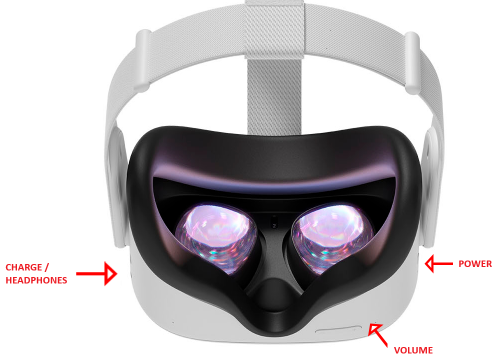
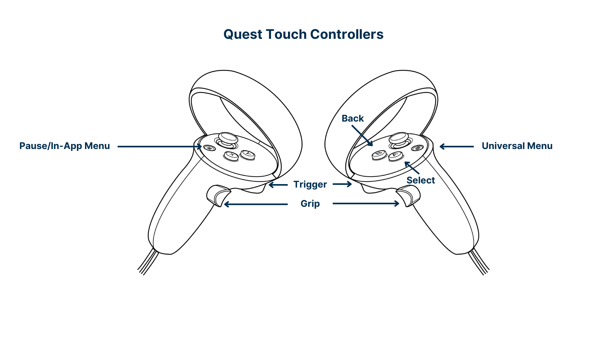

# Meta Quest 2 Quick Start Guide

## Getting a good fit

* Adjust the lenses on the inside of the headset by shifting them left/right until they click into a position which allows you to see most clearly.
* Adjust the straps so they are comfortable for your head.
* If you wear glasses, ensure that you have inserted the glasses spacer.

## Controlling the headset

#### Headset diagram 

#### Controller diagram  

  
*Credit:* [*GIENC*](https://learn.gienc.org/course/meta-quest-2-user-guide/meta-quest-2-user-guide)

## Setting the virtual boundary

When you first turn on the headset you will be prompted to set a boundary.

If you are not prompted, you can set one manually:

* Press the oculus button  on the right controller to open the universal menu.
* Hover over the clock on the left hand side of the menu and open **Quick settings**
* Select **Boundary**
* Follow the onscreen instructions to set the boundary.

In most cases you will be using a **stationary** boundary which is for using the headset whilst sitting or standing in place.

You can also configure a **roomscale** boundary for using the headset while moving around inside a play space.

## FAQ / Common problems

> The controlers are not working

* Try gently double tap the controllers together, this may switch between handsfree and controllers.
* Try using your hands, wave them in front of you face, you will then see your cartoon hands.
  * Point your hand at the clock in the Quest bar, then pinch your finger and thumb to open.
  * Check at the top of screen for the controllers battery status, if they are red please change the battery in the controller.

> I cannot access the content and activities on virtual speech

* Make sure you are connected to "cccu-iot" wifi and not "makerspace"
    * Click the clock on the quest bar, Select Wifi, Select "cccu-iot" from the list, Click Done.
* Virtual speech may be signed out. Contact technicians for instructions on signing back in.

> I cannot access the internet

The WIFI may have dropped off, please inform a technician to reconnect it.

> When I turn on the headset it says that the meta account needs verification

Please inform a technician.

## Contact

[Computing Technician Email](mailto:computingtech@canterbury.ac.uk)  
Please do not contact IT services about these devices.
